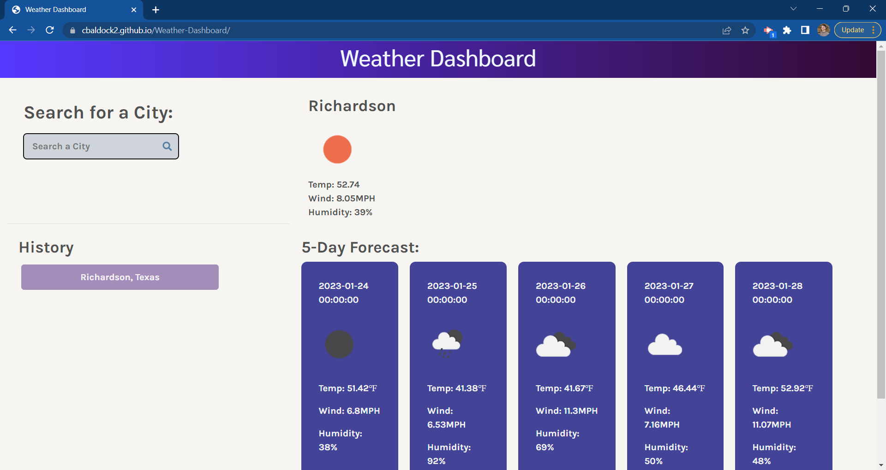

# Weather-Dashboard

## Description
As someone who has family and friends all over the world I wanted to create a weather app that displays the weather for any city. The user can search for a city and it will display the current weather and a 5-day forecast. In the history section, the user will find previous searches that they can click on for a quick way to pull that city's weather information back up.

## Installation
N/A

## Usage
To use the weather dashboard, type in a location and search. Once you search a location, the current weather will appear, as well as, a five day forecast. Also, when you search it will get added to the history section for a quicker way to search for a city's weather you have looked up before.

## Credits
N/A

## Link
<a href='https://cbaldock2.github.io/Weather-Dashboard/'>Weather Dashboard</a>

## Screenshot

## License
Please refer to the LICENSE in the repo.